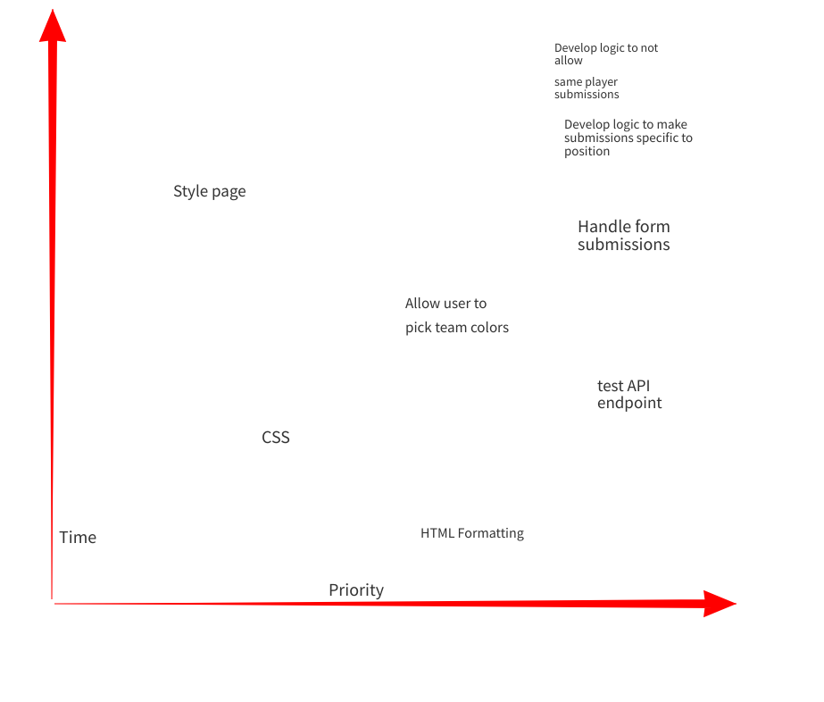

# Dream Team
Project Overview

### Project Name

Dream Team

### Project Description

The goal of my project is to create an application that allows users-namely soccer fans-to create their own "dream team" of their favorite players, or what they think would be the best starting XI of players in the world right now. They will also be allowed to name their team.

### API and Data Sample
https://apifootball.com/

### Wireframe

### MVP

* Create submission form that takes input
* Find and use external api that get soccer players' relevant information and pictures
* Render data on page
* Make submissions position-specific
* Don't allow repeat-submissions

### Post MVP
allow users to choose formation

### Project Schedule

Day   |Deliverable   				                   |Status
------|:--------------------------------------:|-----------:
Aug 30|	Project Approval                       |complete
Aug 31|	Page layout (HTML/CSS structure)       |complete
Sep 1 |	code/psuedocode                        |complete
Sep 2 |	MVP	                                   |complete
Sep 3 |	Presentations                          |incomplete   	

### Priority Matrix

### Timeframe

Comp       |Priority    |Est-Time    |Time-Invst   |Actual
---------- |:----------:|-----------:|------------:|------:
html       |    H       |3           | 3           |       
css        |    H       |3           | 3           |       
handleform |    H       |3           | 4           |       
name team  |    M       |2           | 1           |       
formLog    |    H       |3           | 3           |       
test api   |    H       |2           | 4           |       
get pics   |    M       |2           | 4           |       
get players|    H       |2           | 4           |       
no repeat  |    H       |4           | 1            |       
positionLog|    H       |3           | 3            |       
styling    |    M       |3           | 4            |       
git deploy |    H       |2           | 1            |       
  Total    |            |32          |  35           |   

### Code Snippet

### Change Log
Had to scale back project from a starting XI app to a player information act. Underestimated how hard it would be for me to create 11 different buttons.

